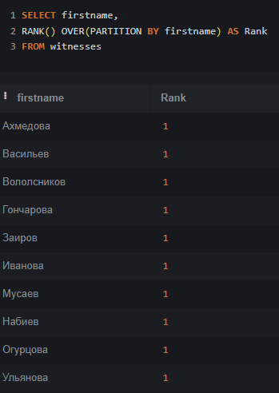

## Юсуфов Умар Фалохиддинович	ИС-22/9-1

### 2.
База данных полиции, в которую входит 5 таблиц:
* crime(преступление);
* detainess(задержанный);
* documents(документы);
* employee(сотрудник);
* witnesses(свидетели).

  

##  2.1
	 Таблица "crime", которая содержит атрибуты:
* crimeid(Айди преступления, настроен по умолчанию, int);
* description(Описание, varchar(799));
* date_and_time(Дата и время, varchar(199));
* information_about_the_accused(Свидение об обвиняемых(799)).

			

	Таблица "detainess", которая содержит атрибуты:
* detainessid(Айди задержанного, настроен по умолчанию, int);
* id_employee(Айди сотрудника, int);
* id_crime(Айди преступления, int);
* date_and_time_of_detention(Дата и время задержания, varchar(799));
* additional_details_of_the_detention(Доп.детали задержания, varchar(799));

				

	Таблица "documents", которая содержит атрибуты:
* documentsid(Айди документа, настроен по умолчанию, int);
* id_crime(Айди преступления, int);
* date_of_creation(Дата создания, varchar(799)).

				

	Таблица "employee", которая содержит атрибуты:	
* employeeid(Айди сотрудника, настроен по умолчанию, int);
* fullname(Имя, varchar(199));
* rank(Звание, varchar(199));
* telephone(Телефон, varchar(199)).

			

	Таблица "witnesses", которая содержит атрибуты
* witnessesid(Айди свидетеля, настроен по умолчанию, int);
* id_crime(Айди преступления, int);
* firstname(Фамилия, varchar(299));
* lastname(Имя, varchar(299)).

				

## 3. Демонстрация работы функции UNION
Объединение двух наборов строк. Я объединил firstname и lastname из таблицы witnesses.

```
SELECT firstname as Фамилия_И_Имя_Свидетеля
from witnesses	
UNION
SELECT lastname AS Фамилия_И_Имя_Свидетеля
FROM witnesses
```
			


## 4. Демонстрация работы функции ORDER BY
Сортировка данных. Я отсортировал описание преступления по возрастанию.
```
SELECT date_and_time, description
FROM crime
ORDER BY description ASC
```


## 5. Демонстрация работы функции HAVING
Я отфильтровал фамилии свидетелей, которые заканчиваются на букву "а"
```
SELECT firstname AS Фамилия FROM witnesses
GROUP BY firstname
HAVING Фамилия LIKE '%а'
```


## 6. Демонстрация работы вложенных запросов
### 6.1. В SELECT
Вывел тех сотрудников, чье звание "Капитан"
```
SELECT fullname, rank
FROM employee
WHERE rank = 
	(SELECT rank
     from employee
     WHERE rank = 'Капитан');
```


### 6.2. В WHERE
Вывел те преступления, которые заканчиваются на букву "о"
```
SELECT description
FROM crime
WHERE description LIKE '%о'
```


## 7. Демонстрация работы оконных функций:
### 7.1. Агрегатные функции
С помощью функции MIN я нашел минимальную стоимость стрижки, с помощью функции MAX я нашел максимальную стоимость стрижки, с помощью функции SUM я нашел суммарную стоимость стрижек, с помощью функции AVG я нашел среднюю стоимость стрижки, с помощью функции COUNT я подсчитал количество рейтингов, равному 5
```
SELECT 
    MIN(Price) AS Минимальная_стоимость,
    MAX(Price) as Максимальная_стоимость,
    SUM(Price) as Сумма,
    AVG(Price) as Средняя_стоимость,
    (SELECT COUNT(*) FROM Feedback WHERE Rating = 5) as Рейтинг_5 
FROM Services
```


### 7.2. Ранжирующие функции
Возвращают значение для каждой строки группы в результирующем наборе данных.
```
SELECT serviceid,
	description,
	price,
	ROW_NUMBER() OVER(PARTITION BY description ORDER BY price) AS 'row_number',
	RANK() OVER(PARTITION BY description ORDER BY price) AS 'rank',
	DENSE_RANK() OVER(PARTITION BY description ORDER BY price) AS 'dense_rank'
FROM Services;
```



### 7.3. Функции смещения
Функции, которые позволяют перемещаться и обращаться к разным строкам в окне.
```
SELECT serviceid,
	description,
	price,
	LAG(price) OVER(PARTITION BY description ORDER BY price) AS 'lag',
	LEAD(price) OVER(PARTITION BY description ORDER BY price) AS 'lead',
	FIRST_VALUE(price) OVER(PARTITION BY description ORDER BY price) AS 'first_value',
	LAST_VALUE(price) OVER(PARTITION BY description ORDER BY price) AS 'last_value'
FROM Services;
```


## 8. Демонстрация работы JOIN'ов:
### 8.1. INNER JOIN
Возвращает те строки, для которых в обеих таблицах выполняется условие соединения.
```
SELECT Name, reviewtext
FROM Clients JOIN Feedback ON Feedback.ClientID = Clients.ClientID
```


