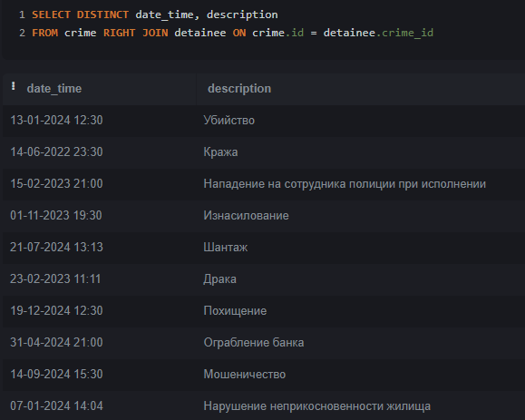

## Юсуфов Умар Фалохиддинович	ИС-22/9-1

### 2.
База данных полиции, в которую входит 5 таблиц:
* crime(преступление);
* detainee(задержанный);
* document(документы);
* employee(сотрудник);
* witness(свидетели).

  

##  2.1
	 Таблица "crime", которая содержит атрибуты:
* id(Айди преступления, настроен по умолчанию, int);
* description(Описание, varchar(799));
* date_time(Дата и время, varchar(199));
* dossier(Свидение об обвиняемых(799)).

			

	Таблица "detaine", которая содержит атрибуты:
* id(Айди задержанного, настроен по умолчанию, int);
* employee_id(Айди сотрудника, int);
* crime_id(Айди преступления, int);
* arrest(Дата и время задержания, varchar(799));
* detaile(Доп.детали задержания, varchar(799));

				

	Таблица "document", которая содержит атрибуты:
* id(Айди документа, настроен по умолчанию, int);
* crime_id(Айди преступления, int);
* date(Дата создания, varchar(799)).

				

	Таблица "employee", которая содержит атрибуты:	
* id(Айди сотрудника, настроен по умолчанию, int);
* fullname(Имя, varchar(199));
* rank(Звание, varchar(199));
* telephone(Телефон, varchar(199));
* gender(Пол, text).

			

	Таблица "witness", которая содержит атрибуты
* id(Айди свидетеля, настроен по умолчанию, int);
* crime_id(Айди преступления, int);
* lastname(Имя, varchar(299));
* firstname(Фамилия, varchar(299)).


				

## 3. Демонстрация работы функции UNION
Объединение двух наборов строк. Я объединил firstname и lastname из таблицы witness.

```sql
SELECT firstname AS Фамилия_И_Имя_Свидетеля
FROM witness	
UNION
SELECT lastname AS Фамилия_И_Имя_Свидетеля
FROM witness
```
		

## 4. Демонстрация работы функции ORDER BY
Сортировка данных. Я отсортировал описание преступления по возрастанию.
```sql
SELECT date_time, description
FROM crime
ORDER BY description ASC
```


## 5. Демонстрация работы функции HAVING
Я отфильтровал фамилии свидетелей, которые заканчиваются на букву "а"
```sql
SELECT firstname AS Фамилия
FROM witness
GROUP BY firstname
HAVING Фамилия LIKE '%а'
```


## 6. Демонстрация работы вложенных запросов
### 6.1. В SELECT
Вывел тех сотрудников, чье звание "Капитан"
```sql
SELECT fullname, rank
FROM employee
WHERE rank = 
	(SELECT rank
     	FROM employee
     	WHERE rank = 'Капитан');
```


### 6.2. В WHERE
Вывел те преступления, которые заканчиваются на букву "о"
```sql
SELECT description
FROM crime
WHERE description LIKE '%о'
```


## 7. Демонстрация работы оконных функций:
### 7.1. Агрегатные функции
С помощью функции COUNT возвращаю количество преступлений
```sql
SELECT COUNT(description) AS Количество_преступлений
FROM crime
```


### 7.2. Ранжирующие функции
Возвращают значение для каждой строки группы в результирующем наборе данных.
```sql
SELECT firstname,
RANK() OVER(PARTITION BY firstname) AS Rank
FROM witness
```


### 7.3. Функции смещения
Функции, которые позволяют перемещаться и обращаться к разным строкам в окне.
```sql
SELECT description, date_time,
LAG(date_time) OVER(PARTITION BY description) AS Lag
FROM crime
```


## 8. Демонстрация работы JOIN'ов:
### 8.1. INNER JOIN
Возвращает те строки, для которых в обеих таблицах выполняется условие соединения.
```sql
SELECT DISTINCT date_time, description
FROM crime INNER JOIN detainee ON crime.id = detainee.crime_id
```


### 8.2. LEFT JOIN
Возвращает те строки, для которых в обеих таблицах выполняется условие соединения.
```sql
SELECT DISTINCT date_time, description
FROM crime LEFT JOIN document ON crime.id = document.crime_id
```


### 8.3. RIGHT JOIN
Возвращает те строки, для которых в обеих таблицах выполняется условие соединения.
```sql
SELECT DISTINCT date_time, description
FROM crime RIGHT JOIN detainee ON crime.id = detainee.crime_id
```



### 8.4. FULL JOIN
Возвращает те строки, для которых в обеих таблицах выполняется условие соединения.
```sql
SELECT DISTINCT date_time, description
FROM crime FULL JOIN detainee ON crime.id = detainee.crime_id
```


### 8.5. CROSS JOIN
Возвращает те строки, для которых в обеих таблицах выполняется условие соединения.
```sql
SELECT DISTINCT date_time, description
FROM crime CROSS JOIN detainee ON crime.id = detainee.crime_id
```


## 9. Демонстрация работы CASE
Оператор позволяет осуществить проверку условий и возвратить в зависимости от выполнения того или иного условия тот или иной результат.
```sql
SELECT fullname,
	CASE
    	WHEN Gender = 'Мужчина' THEN 'Мужчина'
        ELSE 'Женщина'
    END AS Пол 
FROM employee
```


## 10. Демонстрация работы WITH
Используется для создания временных таблиц, которые можно использовать внутри запросов (trap).
```sql
WITH trap AS
(SELECT fullname, telephone FROM employee)
SELECT * FROM trap
```

