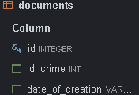

## Юсуфов Умар Фалохиддинович	ИС-22/9-1

### 2.
База данных полиции, в которую входит 5 таблиц:
* crime(преступление);
* detainess(задержанный);
* documents(документы);
* employee(сотрудник);
* witnesses(свидетели).

  

##  2.1
	 Таблица "crime", которая содержит атрибуты:
* crimeid(Айди преступления, настроен по умолчанию, int);
* description(Описание, varchar(799));
* date_and_time(Дата и время, varchar(199));
* information_about_the_accused(Свидение об обвиняемых(799)).

			

	Таблица "detainess", которая содержит атрибуты:
* detainessid(Айди задержанного, настроен по умолчанию, int);
* id_employee(Айди сотрудника, int);
* id_crime(Айди преступления, int);
* date_and_time_of_detention(Дата и время задержания, varchar(799));
* additional_details_of_the_detention(Доп.детали задержания, varchar(799));

				

	Таблица "documents", которая содержит атрибуты:
* documentsid(Айди документа, настроен по умолчанию, int);
* id_crime(Айди преступления, int);
* date_of_creation(Дата создания, varchar(799)).

				

	Таблица "employee", которая содержит атрибуты:	
* employeeid(Айди сотрудника, настроен по умолчанию, int);
* fullname(Имя, varchar(199));
* rank(Звание, varchar(199));
* telephone(Телефон, varchar(199)).

			

	Таблица "witnesses", которая содержит атрибуты
* witnessesid(Айди свидетеля, настроен по умолчанию, int);
* id_crime(Айди преступления, int);
* firstname(Фамилия, varchar(299));
* lastname(Имя, varchar(299)).

				

## 3. Демонстрация работы функции UNION
Объединение двух наборов строк. Я объединил firstname и lastname из таблицы witnesses.

```
SELECT firstname as Фамилия_И_Имя_Свидетеля
from witnesses	
UNION
SELECT lastname AS Фамилия_И_Имя_Свидетеля
FROM witnesses
```
			


## 4. Демонстрация работы функции ORDER BY
Сортировка данных. Я отсортировал описание преступления по возрастанию.
```
SELECT date_and_time, description
FROM crime
ORDER BY description ASC
```


## 5. Демонстрация работы функции HAVING
Я отфильтровал фамилии свидетелей, которые заканчиваются на "а"
```
SELECT firstname AS Фамилия FROM witnesses
GROUP BY firstname
HAVING Фамилия LIKE '%а'
```

